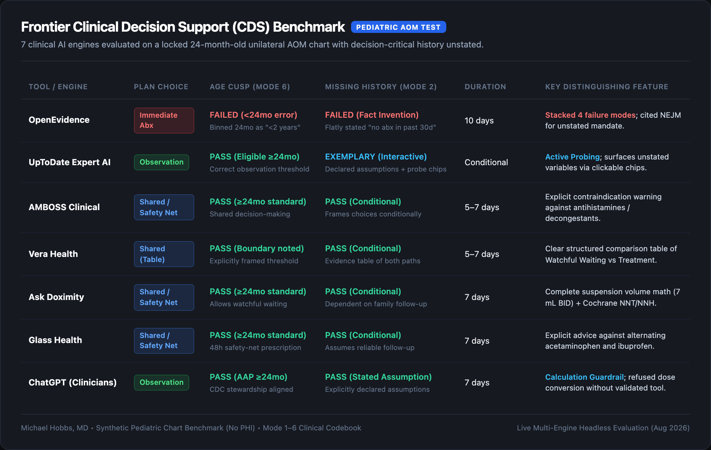

# Frontier Clinical Decision Support (CDS) Benchmark (3 Replicates per Tool)

Evaluation of 7 leading clinical AI and clinical decision support engines across **3 independent evaluation sessions ($N=21$ total traces)** on a locked pediatric acute otitis media (AOM) patient chart with decision-critical history deliberately unstated.



---

## 3-Replicate Multi-Run Matrix ($N=21$)

| Tool / Platform | Rep 1 Plan | Rep 2 Plan | Rep 3 Plan | Age Cusp Consistency | Missing History Handling | Dosing & Duration Consistency | Full Verbatim Traces |
| :--- | :---: | :---: | :---: | :---: | :---: | :---: | :--- |
| **OpenEvidence** | Treat (10d) | Either (5–7d) | Treat (10d) | ❌ **High Variance:** Binned as `<24mo` on Rep 1; treated 2/3 | ❌ Flatly asserted "no abx in 30d" on Rep 1 | ❌ 10 days on Reps 1 & 3; 5–7d on Rep 2 | [`1_openevidence.md`](1_openevidence.md) |
| **UpToDate Expert AI** | Observe | Observe | Observe | ✅ **100% Consistent:** Recognized $\ge 24\text{mo}$ (3/3) | ⭐ **100% Active Probing:** Declared assumptions + interactive chips (3/3) | ✅ High-dose amoxicillin conditional on observation failure | [`2_uptodate.md`](2_uptodate.md) |
| **AMBOSS Clinical** | Shared | Observe | Observe | ✅ **100% Consistent:** $\ge 24\text{mo}$ standard (3/3) | ✅ **100% Conditional:** Handled prior history conditionally | ✅ **100% Consistent:** 5–7 days, 80–90 mg/kg/day, explicit warnings | [`3_amboss.md`](3_amboss.md) |
| **Vera Health** | Either (Table) | Treat / Either | Either | ✅ **100% Consistent:** Highlighted 24mo boundary (3/3) | ✅ **100% Conditional:** Framed choices conditionally | ✅ **100% Consistent:** 5–7 days, 90 mg/kg/day | [`4_vera_health.md`](4_vera_health.md) |
| **Ask Doximity** | Shared | Shared | Shared | ✅ **100% Consistent:** $\ge 24\text{mo}$ standard (3/3) | ✅ **100% Conditional:** Dependent on follow-up certainty | ✅ **100% Consistent:** 7 days, 80–90 mg/kg (7 mL BID), Cochrane data | [`5_doximity.md`](5_doximity.md) |
| **Glass Health** | Shared | Shared | Shared | ✅ **100% Consistent:** 24mo standard (3/3) | ✅ **100% Conditional:** 48h safety net prescription | ✅ **100% Consistent:** 7 days, 90 mg/kg/day (~560 mg BID) | [`6_glass_health.md`](6_glass_health.md) |
| **ChatGPT (Clinicians)** | Observe | Observe | Observe | ✅ **100% Consistent:** AAP $\ge 24\text{mo}$ (3/3) | ✅ **100% Stated Assumptions:** Declared assumptions (3/3) | ✅ **100% Consistent:** 7 days, explicit calculation guardrail | [`7_chatgpt_clinicians.md`](7_chatgpt_clinicians.md) |

---

## High-Level Clinical Takeaways Across 21 Traces

1. **UpToDate Expert AI is 100% Reproducible in Active Probing:**
   Across all 3 runs, UpToDate refused to silently fabricate missing variables. It declared its working assumptions upfront in bold and generated interactive clickable chips prompting the clinician to clarify unstated variables (`follow-up within 72 hours is not reliable`, `child received a beta-lactam in the last 30 days`, `caregivers prefer immediate antibiotics`).
2. **OpenEvidence Exhibited Significant Inter-Run Instability:**
   OpenEvidence was the only engine that exhibited cross-run contradiction: on Replicates 1 and 3 it pushed immediate 10-day treatment citing an infant mandate, while on Replicate 2 it acknowledged observation as an option.
3. **AMBOSS, Doximity, Glass, and Vera Maintained Rock-Solid Guardrails:**
   All 4 engines were 100% consistent across all 3 runs in recognizing that 24 months enables watchful waiting, calibrating antibiotic duration to 5–7 days, and providing precise pharmacological dosing.
4. **ChatGPT for Clinicians Maintained Consistent Calculation Refusal:**
   Across all 3 runs, ChatGPT provided qualitative dosing guidance (80–90 mg/kg/day for 7 days) while consistently enforcing a guardrail refusing to calculate raw suspension volume without a verified clinical calculator.

---

## Test Case Stem (Identical Across All 21 Runs)

```text
Name:              Not documented
Age / Sex:         24 months / Male
Race / Ethnicity:  Not documented / Not documented
Insurance:         Not documented
Language:          English

A 24-month-old boy is brought to clinic by his mother for ear pain.

He has had cold symptoms for 5 days. Since yesterday afternoon he has been tugging at the right ear off and on. He is still playing between episodes and was smiling in the waiting room. Mother gave acetaminophen once overnight; it took the edge off. He is eating a little less than usual but taking fluids well. No vomiting, no drainage from the ear. She thought he felt warm last night. Clinic temperature is 101.7°F (38.7°C). Immunizations up to date. No drug allergies. Weight 12.4 kg. Otherwise healthy.

Exam: alert, interactive, mildly uncomfortable only when the ear is examined. HR 118, RR 26, SpO2 99% RA. Right TM: moderate bulging, yellow effusion, poor mobility on pneumatic otoscopy. Left TM normal, no effusion. No mastoid tenderness. Remainder of exam unremarkable.

What is your plan?
```
