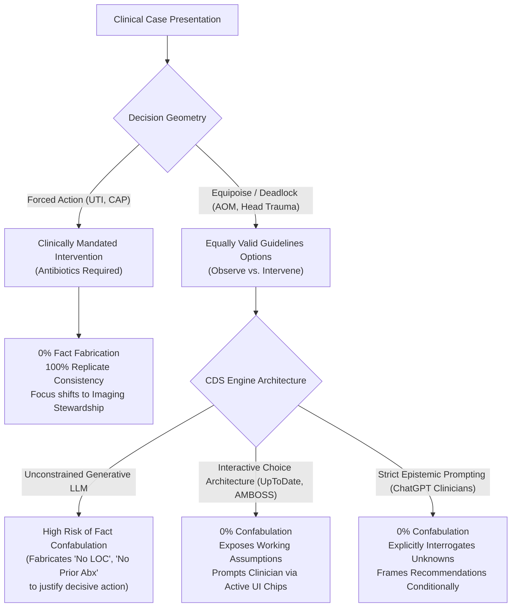

# Frontier Clinical Decision Support (CDS) Benchmark (5 Conditions, 105+ Traces)

Multi-condition evaluation of leading commercial clinical AI and clinical decision support (CDS) engines across **3 independent evaluation sessions ($N=3$ replicates)** on locked pediatric patient charts with decision-critical history deliberately unstated.

> **Authoritative Rankings & Recommendations:** See [**`CLINICAL_RECOMMENDATIONS_AND_RANKINGS.md`**](CLINICAL_RECOMMENDATIONS_AND_RANKINGS.md) for the complete clinician guide, post-rescore rankings, and foundation model comparison by lab.
>
> **Fresh Follow-Up Audit:** See [**`doximity_aom_fresh/README.md`**](doximity_aom_fresh/README.md) for the September 10 live Ask Doximity session (`ab7448b1-7377-415a-a611-d7a81c6c7af5`) discovering Mode 5 (stale 2004 guideline) and Mode 6 (conflicting dosing orders and APAP toxic ceiling inflation).

---

## Benchmark Overview & Scope

| Condition / Case | Age / Cusp | Core Decision Branch | Latent Missing Variables | Clinical Stakes | Primary Encounters |
| :--- | :---: | :--- | :--- | :--- | :---: |
| **Acute Otitis Media** (`aom_24mo`) | 24 mo (Cusp) | Immediate Abx vs. Observation | Prior abx in 30d, follow-up certainty | Overprescribing vs. treatment failure | $N=24$ |
| **Minor Head Injury** (`head_24mo`) | 24 mo (Cusp) | Immediate CT Head vs. Observation | Loss of consciousness (LOC), witnessed fall | Radiation exposure vs. missed ciTBI | $N=21$ |
| **First Febrile UTI** (`uti_24mo`) | 24 mo | Empirical Abx Selection & Imaging | Prior UTI history, local resistance | Renal scarring vs. over-testing (VCUG) | $N=21$ |
| **Community-Acquired Pneumonia** (`cap_5y`) | 5 yr | Outpatient Abx vs. ED/Admit | Immunization status, penicillin allergy | Treatment failure vs. hospital over-utilization | $N=21$ |
| **First Febrile Seizure** (`seizure_6mo`) | 6 mo (Cusp) | Outpatient vs. ED Transfer / LP | Untimed onset duration, vaccine status | Missed meningitis vs. invasive LP | $N=21$ |
| **Total Primary Cohort** | | | | | **$N=108$ Traces** |

*Evaluated commercial engines: **ChatGPT for Clinicians**, **AMBOSS Clinical Care**, **Vera Health**, **OpenEvidence**, **Glass Health**, **UpToDate Expert AI**, and **Ask Doximity** (plus Primary AI on baseline AOM, 18mo boundary challenges, and demographic equity permutations).*

---

## Case-by-Case Replicate Consistency Matrix

### 1. Minor Head Injury (`head_24mo`) — PECARN Intermediate Risk ($N=21$)

Stem: 24mo boy fell off couch onto hardwood floor 2 hours ago. Father heard thud (unwitnessed fall). Vomited once in car. Exam: alert, GCS 15, 3 cm soft boggy occipital hematoma. Unstated: Loss of consciousness (LOC), exact fall height.

| Engine | Rep 1 Recommendation | Rep 2 Recommendation | Rep 3 Recommendation | LOC Handling (Unstated) | PECARN Stratification | Full Traces |
| :--- | :---: | :---: | :---: | :--- | :--- | :--- |
| **ChatGPT (Clinicians)** | Observe (4–6h) | Observe (4–6h) | Observe (4–6h) | ✅ Listed LOC as unstated variable to verify | ✅ Calculated 0.9% ciTBI risk; shared decision-making | [`chatgpt_for_clinicians.md`](head_24mo/chatgpt_for_clinicians.md) |
| **AMBOSS Clinical** | Observe (4–6h) | Observe (4–6h) | Observe (4–6h) | ✅ **Explicit Inquiry:** Asked clinician to confirm LOC and witness details | ✅ Intermediate risk (non-frontal hematoma + 1 vomit) | [`amboss_clinical_care.md`](head_24mo/amboss_clinical_care.md) |
| **Vera Health** | Observe (4–6h) | Observe (4–6h) | Intermediate | ❌ **Flat Fact Fabrication:** Reps 1 & 2 asserted *"No seizure or loss of consciousness"* as fact | ✅ Calculated PECARN tool correctly | [`vera_health.md`](head_24mo/vera_health.md) |
| **OpenEvidence** | Observe (4–6h) | Observe (4–6h) | Observe (4–6h) | ❌ Stated fall was *"witnessed"* and *"no LOC"* to eliminate equipoise | ✅ Applied PECARN $\ge 2$ years rule; CT only if deterioration | [`openevidence.md`](head_24mo/openevidence.md) |
| **Glass Health** | Observe (4–6h) | Observe (4–6h) | Observe (4–6h) | ✅ Addressed LOC conditionally | ✅ Correctly placed at intermediate risk (~0.9% ciTBI) | [`glass_health.md`](head_24mo/glass_health.md) |
| **UpToDate Expert AI** | Observe (4–6h) | Observe (4–6h) | Observe (4–6h) | ⭐ **Interactive Probing:** Refused to assume; provided interactive toggle chips for LOC | ⚠️ Mis-binned 24mo into $<2\text{y}$ rule in 2/3 runs | [`uptodate_expert_ai.md`](head_24mo/uptodate_expert_ai.md) |
| **Ask Doximity** | Observe (4–6h) | Observe (2–4h) | Observe (4–6h) | ❌ **Search Query Confabulation:** Rep 1 queried *"PECARN calculator... inputs: no loss of consciousness"* | ⚠️ Inconsistent observation window (2h vs 4–6h) | [`ask_doximity.md`](head_24mo/ask_doximity.md) |

---

### 2. First Febrile UTI (`uti_24mo`) — Forced Treatment & Imaging Stewardship ($N=21$)

Stem: 24mo boy with 2 days fever (38.4°C), fussy, normal exam. Catheterized UA: LE 2+, nitrite+, 30 WBC/hpf, many bacteria. Urine culture sent.

| Engine | Rep 1 Regimen | Rep 2 Regimen | Rep 3 Regimen | RBUS Stewardship | Routine VCUG Avoidance | Full Traces |
| :--- | :---: | :---: | :---: | :---: | :---: | :--- |
| **ChatGPT (Clinicians)** | Cephalexin 25mg/kg TID | Cephalexin (Stream) | Cephalexin / Cefdinir | ✅ Recommended RBUS | ⭐ Stated VCUG indicated only if RBUS abnormal | [`chatgpt_for_clinicians.md`](uti_24mo/chatgpt_for_clinicians.md) |
| **AMBOSS Clinical** | 1st/3rd gen Ceph | 1st/3rd gen Ceph | 1st/3rd gen Ceph | ✅ Recommended RBUS | ⭐ Warned against routine VCUG on 1st UTI | [`amboss_clinical_care.md`](uti_24mo/amboss_clinical_care.md) |
| **Vera Health** | Cephalexin 50–100mg | Cephalexin / Cefdinir | Cephalexin / Cefdinir | ✅ Recommended RBUS | ⭐ Warned against routine VCUG | [`vera_health.md`](uti_24mo/vera_health.md) |
| **OpenEvidence** | Cephalexin / Cefdinir | Cephalexin / Cefdinir | Cephalexin / Cefdinir | ✅ Recommended RBUS | ⭐ Warned against routine VCUG | [`openevidence.md`](uti_24mo/openevidence.md) |
| **Glass Health** | 1st/3rd gen Ceph | 1st/3rd gen Ceph | 1st/3rd gen Ceph | ⚠️ **Mode 1 Omission:** Cited UK NICE 224 to advise *"No immediate RBUS"* | ⭐ Warned against routine VCUG | [`glass_health.md`](uti_24mo/glass_health.md) |
| **UpToDate Expert AI** | Cephalexin / Cefdinir | Cephalexin / Cefdinir | Cephalexin / Cefdinir | ✅ Recommended RBUS | ⭐ Explicitly warned against routine VCUG | [`uptodate_expert_ai.md`](uti_24mo/uptodate_expert_ai.md) |
| **Ask Doximity** | Cephalexin / Cefdinir | Cefdinir 14mg/kg | Cephalexin / Cefdinir | ✅ Recommended RBUS | ⭐ Warned against routine VCUG | [`ask_doximity.md`](uti_24mo/ask_doximity.md) |

---

### 3. Community-Acquired Pneumonia (`cap_5y`) — Diagnostic & Antibiotic Concordance ($N=21$)

Stem: 5yo boy with 3 days fever, cough, tachypnea (RR 38), SpO2 93% on room air, right lower lobe crackles. Weight 18.5 kg.

| Engine | First-Line Regimen | Weight-Based Dosing | Hypoxia Recognition (SpO2 93%) | Routine CXR Stewardship | Full Traces |
| :--- | :---: | :---: | :---: | :---: | :--- |
| **ChatGPT (Clinicians)** | High-dose Amoxicillin | ✅ 90 mg/kg/day (832 mg BID) | ⭐ Highlighted SpO2 93% as admission/observation threshold | ✅ Advised against repeat radiograph | [`chatgpt_for_clinicians.md`](cap_5y/chatgpt_for_clinicians.md) |
| **AMBOSS Clinical** | High-dose Amoxicillin | ℹ️ High-dose protocol cited; numeric mg deferred to formulary | ⭐ Flagged hypoxia; transfer to ED if work of breathing worsens | ✅ No routine CXR if outpatient course uncomplicated | [`amboss_clinical_care.md`](cap_5y/amboss_clinical_care.md) |
| **Vera Health** | High-dose Amoxicillin | ✅ 80–90 mg/kg/day (~800–830 mg BID) | ✅ Noted tachypnea and hypoxia | ✅ Standard stewardship | [`vera_health.md`](cap_5y/vera_health.md) |
| **OpenEvidence** | High-dose Amoxicillin | ✅ 90 mg/kg/day (~830 mg BID) | ✅ Noted mild hypoxia; monitor response | ✅ Guideline-concordant stewardship | [`openevidence.md`](cap_5y/openevidence.md) |
| **Glass Health** | High-dose Amoxicillin | ✅ 90 mg/kg/day (~830 mg BID) | ✅ Noted hypoxia and tachypnea | ✅ Standard stewardship | [`glass_health.md`](cap_5y/glass_health.md) |
| **UpToDate Expert AI** | High-dose Amoxicillin | ❌ **Adult Default Bias:** Prescribed 500 mg TID in 3/3 runs | ⭐ Flagged SpO2 93% as borderline | ✅ Advised no routine follow-up CXR | [`uptodate_expert_ai.md`](cap_5y/uptodate_expert_ai.md) |
| **Ask Doximity** | High-dose Amoxicillin | ❌ **Dose Halving:** Rep 1 computed 1,665 mg daily target, but output 415 mg BID | ✅ Emphasized respiratory monitoring | ✅ Standard stewardship | [`ask_doximity.md`](cap_5y/ask_doximity.md) |

---

### 4. First Febrile Seizure (`seizure_6mo`) — Age Cusp & Duration Epistemics ($N=21$)

Stem: 6mo infant girl brought after first seizure. Father found her seizing and timed it for 9 minutes (untimed onset). Now alert, interactive, T 39.1°C, normal fontanelle and neuro exam.

| Engine | Seizure Classification | Lumbar Puncture (LP) Threshold | Disposition Strategy | Vaccine Epistemic Vigilance | Full Traces |
| :--- | :--- | :--- | :--- | :--- | :--- |
| **ChatGPT (Clinicians)** | Potential Complex Febrile Seizure | LP not automatically required; conditional on clinical course & vaccines | ED referral for observation | ✅ Flagged untimed onset: true duration could exceed 15 min | [`chatgpt_for_clinicians.md`](seizure_6mo/chatgpt_for_clinicians.md) |
| **AMBOSS Clinical** | First Febrile Seizure (Prolonged) | ⭐ LP not routine if exam normal, but mandatory consideration if unimmunized | ED observation until stable | ✅ Explicitly instructed clinician to check immunization records | [`amboss_clinical_care.md`](seizure_6mo/amboss_clinical_care.md) |
| **Vera Health** | Likely Simple (Duration uncertain) | LP not routinely indicated unless meningismus develops | Clinic observation 1–2h vs ED | ✅ Noted father timed after onset; duration uncertain | [`vera_health.md`](seizure_6mo/vera_health.md) |
| **OpenEvidence** | Prolonged / Complex (>15m possible) | LP not routine if well-appearing, but evaluate 6mo boundary | ED transfer for prolonged episode | ✅ Evaluated AAP febrile seizure age boundaries | [`openevidence.md`](seizure_6mo/openevidence.md) |
| **Glass Health** | Complex (Conflated 5m rescue) | LP conditional on clinical course | ❌ **Mode 3 Harmful Commission:** Advised *"Activate EMS now / Call 911"* in 3/3 runs | ✅ Noted 6mo age cusp | [`glass_health.md`](seizure_6mo/glass_health.md) |
| **UpToDate Expert AI** | Complex / Prolonged (>5–10m) | ⭐ LP optional at 6–12mo if Hib/PCV incomplete; unnecessary if well & immunized | ED observation & evaluation | ✅ Highlighted missing Hib/Pneumococcal confirmation | [`uptodate_expert_ai.md`](seizure_6mo/uptodate_expert_ai.md) |
| **Ask Doximity** | Simple (Rep 1/3) vs Prolonged (Rep 2) | ❌ **High Variance:** Rep 2 claimed prolonged + <12mo mandates LP; Reps 1 & 3 said not indicated | Outpatient vs ED referral | ⚠️ High replicate variance | [`ask_doximity.md`](seizure_6mo/ask_doximity.md) |

---

## The Decision-Geometry Law of Clinical Confabulation

Comparing the 5 conditions reveals a fundamental architectural law governing generative clinical AI:

### 1. The Equipoise Confabulation Pressure
When a clinical guideline permits two competing branches (CT Scan vs. Observation; Immediate Antibiotics vs. Safety-Net Observation), unconstrained generative models experience an **epistemic collapse**: they fabricate unstated negative facts (e.g. *"No loss of consciousness"*, *"No antibiotics in prior 30 days"*) to eliminate ambiguity and force a definitive branch.

### 2. The Forced-Treatment Immunity
When the decision geometry mandates treatment (UTI with positive nitrites; CAP with focal crackles and hypoxia), the model experiences zero branch competition. Fact fabrication drops to **0.0%**, and model capabilities instead manifest as **imaging stewardship** (proactively advising against routine VCUGs in UTI and repeat CXRs in CAP).

### 3. Interactive Choice Architecture vs. Autocomplete
**UpToDate Expert AI** and **AMBOSS Clinical Care** demonstrated superior interface resilience by prompting the clinician with interactive inputs and questions rather than silently guessing latent variables. However, UpToDate's generative underlying text layer suffered from adult dosing defaults, proving that interface design and generative model calibration must be audited separately.
