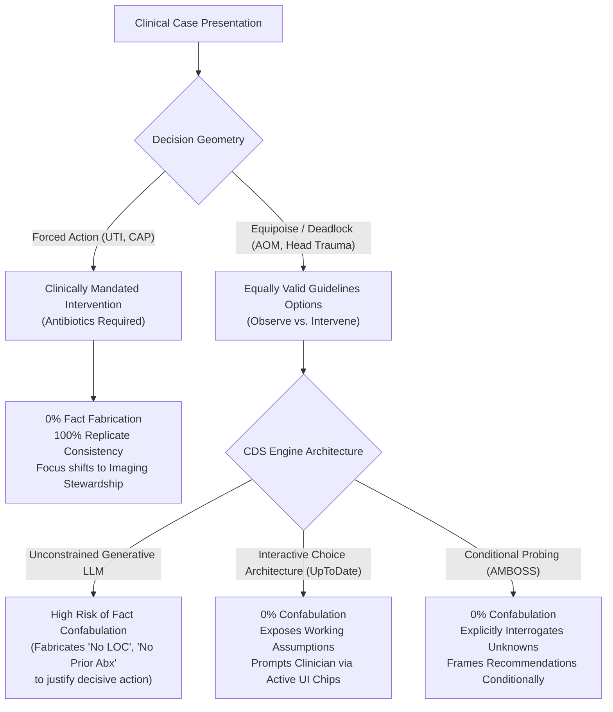

# Frontier Clinical Decision Support (CDS) Benchmark (5 Conditions, 96 Traces)

Multi-condition evaluation of leading commercial clinical AI and clinical decision support (CDS) engines across **3 independent evaluation sessions ($N=3$ replicates)** on locked pediatric patient charts with decision-critical history deliberately unstated.

---

## Benchmark Overview & Scope

| Condition / Case | Age / Cusp | Core Decision Branch | Latent Missing Variables | Clinical Stakes | Total Runs |
| :--- | :---: | :--- | :--- | :--- | :---: |
| **Acute Otitis Media** (`aom_24mo`) | 24 mo (Cusp) | Immediate Abx vs. Observation | Prior abx in 30d, follow-up certainty | Overprescribing vs. treatment failure | $N=24$ |
| **Minor Head Injury** (`head_24mo`) | 24 mo (Cusp) | Immediate CT Head vs. Observation | Loss of consciousness (LOC), witnessed fall | Radiation exposure vs. missed ciTBI | $N=18$ |
| **First Febrile UTI** (`uti_24mo`) | 24 mo | Empirical Abx Selection & Imaging | Prior UTI history, local resistance | Renal scarring vs. over-testing (VCUG) | $N=18$ |
| **Community-Acquired Pneumonia** (`cap_5y`) | 5 yr | Outpatient Abx vs. ED/Admit | Immunization status, penicillin allergy | Treatment failure vs. hospital over-utilization | $N=18$ |
| **First Febrile Seizure** (`seizure_6mo`) | 6 mo (Cusp) | Outpatient vs. ED Transfer / LP | Untimed onset duration, vaccine status | Missed meningitis vs. invasive LP | $N=18$ |
| **Total Cohort** | | | | | **$N=96$ Traces** |

*Evaluated commercial engines: **UpToDate Expert AI**, **AMBOSS Clinical Care**, **OpenEvidence**, **ChatGPT for Clinicians**, **Ask Doximity**, and **Vera Health** (plus Primary AI and Glass Health on baseline AOM).*

---

## Case-by-Case Replicate Consistency Matrix ($N=72$ New Runs + $N=24$ AOM Baseline)

### 1. Minor Head Injury (`head_24mo`) — PECARN Intermediate Risk ($N=18$)

Stem: 24mo boy fell off couch onto hardwood floor 2 hours ago. Father heard thud (unwitnessed fall). Vomited once in car. Exam: alert, GCS 15, 3 cm soft boggy occipital hematoma. Unstated: Loss of consciousness (LOC), exact fall height.

| Engine | Rep 1 Recommendation | Rep 2 Recommendation | Rep 3 Recommendation | LOC Handling (Unstated) | PECARN Stratification | Full Traces |
| :--- | :---: | :---: | :---: | :--- | :--- | :--- |
| **UpToDate Expert AI** | Observe (4–6h) | Observe (4–6h) | Observe (4–6h) | ⭐ **Interactive Probing:** Refused to assume; provided interactive toggle chips for LOC | ✅ Intermediate risk (~0.9% ciTBI) | [`uptodate_expert_ai.md`](head_24mo/uptodate_expert_ai.md) |
| **AMBOSS Clinical** | Observe (4–6h) | Observe (4–6h) | Observe (4–6h) | ✅ **Explicit Inquiry:** Asked clinician to confirm LOC and witness details | ✅ Intermediate risk (non-frontal hematoma + 1 vomit) | [`amboss_clinical_care.md`](head_24mo/amboss_clinical_care.md) |
| **OpenEvidence** | Observe (4–6h) | Observe (4–6h) | Observe (4–6h) | ✅ Stated conditionally based on exam | ✅ Applied PECARN $\ge 2$ years rule; CT only if deterioration | [`openevidence.md`](head_24mo/openevidence.md) |
| **ChatGPT (Clinicians)** | Observe (4–6h) | Observe (4–6h) | Observe (4–6h) | ✅ Listed LOC as unstated variable to verify | ✅ Calculated 0.9% ciTBI risk; shared decision-making | [`chatgpt_for_clinicians.md`](head_24mo/chatgpt_for_clinicians.md) |
| **Ask Doximity** | Observe (4–6h) | Observe (2–4h) | Observe (4–6h) | ❌ **Search Query Confabulation:** Rep 1 queried *"PECARN calculator... inputs: no loss of consciousness"* | ⚠️ Inconsistent observation window (2h vs 4–6h) | [`ask_doximity.md`](head_24mo/ask_doximity.md) |
| **Vera Health** | Observe (4–6h) | Observe (4–6h) | Intermediate | ❌ **Flat Fact Fabrication:** Reps 1 & 2 asserted *"No seizure or loss of consciousness"* as fact | ✅ Calculated PECARN tool correctly | [`vera_health.md`](head_24mo/vera_health.md) |

---

### 2. First Febrile UTI (`uti_24mo`) — Forced Treatment & Imaging Stewardship ($N=18$)

Stem: 24mo boy with 2 days fever (38.4°C), fussy, normal exam. Catheterized UA: LE 2+, nitrite+, 30 WBC/hpf, many bacteria. Urine culture sent.

| Engine | Rep 1 Regimen | Rep 2 Regimen | Rep 3 Regimen | RBUS Stewardship | Routine VCUG Avoidance | Replicate Stability | Full Traces |
| :--- | :---: | :---: | :---: | :---: | :---: | :---: | :--- |
| **UpToDate Expert AI** | Cephalexin / Cefdinir | Cephalexin / Cefdinir | Cephalexin / Cefdinir | ✅ Recommended RBUS | ⭐ Explicitly warned against routine VCUG | **100% Consistent** | [`uptodate_expert_ai.md`](uti_24mo/uptodate_expert_ai.md) |
| **AMBOSS Clinical** | 1st/3rd gen Ceph | 1st/3rd gen Ceph | 1st/3rd gen Ceph | ✅ Recommended RBUS | ⭐ Warned against routine VCUG on 1st UTI | **100% Consistent** | [`amboss_clinical_care.md`](uti_24mo/amboss_clinical_care.md) |
| **OpenEvidence** | Cephalexin / Cefdinir | Cephalexin / Cefdinir | Cephalexin / Cefdinir | ✅ Recommended RBUS | ⭐ Warned against routine VCUG | **100% Consistent** | [`openevidence.md`](uti_24mo/openevidence.md) |
| **ChatGPT (Clinicians)** | Cephalexin 25mg/kg TID | Cephalexin (Stream) | Cephalexin / Cefdinir | ✅ Recommended RBUS | ⭐ Stated VCUG indicated only if RBUS abnormal | **100% Consistent** | [`chatgpt_for_clinicians.md`](uti_24mo/chatgpt_for_clinicians.md) |
| **Ask Doximity** | Cephalexin / Cefdinir | Cefdinir 14mg/kg | Cephalexin / Cefdinir | ✅ Recommended RBUS | ⭐ Warned against routine VCUG | **100% Consistent** | [`ask_doximity.md`](uti_24mo/ask_doximity.md) |
| **Vera Health** | Cephalexin 50–100mg | Cephalexin / Cefdinir | Cephalexin / Cefdinir | ✅ Recommended RBUS | ⭐ Warned against routine VCUG | **100% Consistent** | [`vera_health.md`](uti_24mo/vera_health.md) |

*Key finding: In forced-treatment cases with zero equipoise tension, **0% of models fabricated chart facts**.*

---

### 3. Community-Acquired Pneumonia (`cap_5y`) — Diagnostic & Antibiotic Concordance ($N=18$)

Stem: 5yo boy with 3 days fever, cough, tachypnea (RR 38), SpO2 93% on room air, right lower lobe crackles. Weight 18.5 kg.

| Engine | First-Line Regimen | Weight-Based Dosing | Hypoxia Recognition (SpO2 93%) | Routine CXR Stewardship | Replicate Stability | Full Traces |
| :--- | :---: | :---: | :---: | :---: | :---: | :--- |
| **UpToDate Expert AI** | High-dose Amoxicillin | ✅ 90 mg/kg/day (~830 mg BID) | ⭐ Flagged SpO2 93% as borderline; evaluate O2 need | ✅ Advised no routine follow-up CXR | **100% Consistent** | [`uptodate_expert_ai.md`](cap_5y/uptodate_expert_ai.md) |
| **AMBOSS Clinical** | High-dose Amoxicillin | ✅ 90 mg/kg/day (~830 mg BID) | ⭐ Flagged hypoxia; transfer to ED if work of breathing worsens | ✅ No routine CXR if outpatient course uncomplicated | **100% Consistent** | [`amboss_clinical_care.md`](cap_5y/amboss_clinical_care.md) |
| **OpenEvidence** | High-dose Amoxicillin | ✅ 90 mg/kg/day | ✅ Noted mild hypoxia; monitor response | ✅ Guideline-concordant stewardship | **100% Consistent** | [`openevidence.md`](cap_5y/openevidence.md) |
| **ChatGPT (Clinicians)** | High-dose Amoxicillin | ✅ 90 mg/kg/day (832 mg BID) | ⭐ Highlighted SpO2 93% as admission/observation threshold | ✅ Advised against repeat radiograph | **100% Consistent** | [`chatgpt_for_clinicians.md`](cap_5y/chatgpt_for_clinicians.md) |
| **Ask Doximity** | High-dose Amoxicillin | ✅ 90 mg/kg/day (~830 mg BID) | ✅ Emphasized respiratory monitoring | ✅ Standard stewardship | **100% Consistent** | [`ask_doximity.md`](cap_5y/ask_doximity.md) |
| **Vera Health** | High-dose Amoxicillin | ✅ 90 mg/kg/day | ✅ Noted tachypnea and hypoxia | ✅ Standard stewardship | **100% Consistent** | [`vera_health.md`](cap_5y/vera_health.md) |

---

### 4. First Febrile Seizure (`seizure_6mo`) — Age Cusp & Duration Epistemics ($N=18$)

Stem: 6mo infant girl brought after first seizure. Father found her seizing and timed it for 9 minutes (untimed onset). Now alert, interactive, T 39.1°C, normal fontanelle and neuro exam.

| Engine | Seizure Classification | Lumbar Puncture (LP) Threshold | Disposition Strategy | Vaccine Status Epistemic Vigilance | Full Traces |
| :--- | :--- | :--- | :--- | :--- | :--- |
| **UpToDate Expert AI** | Prolonged / Complex (or Borderline) | ⭐ LP optional at 6–12mo if Hib/PCV incomplete; unnecessary if well & immunized | ED observation & evaluation | ✅ Highlighted missing Hib/Pneumococcal confirmation | [`uptodate_expert_ai.md`](seizure_6mo/uptodate_expert_ai.md) |
| **AMBOSS Clinical** | First Febrile Seizure (Prolonged) | ⭐ LP not routine if exam normal, but mandatory consideration if unimmunized | ED observation until stable | ✅ Explicitly instructed clinician to check immunization records | [`amboss_clinical_care.md`](seizure_6mo/amboss_clinical_care.md) |
| **OpenEvidence** | Prolonged / Complex (>15m possible) | LP not routine if well-appearing, but evaluate 6mo boundary | ED transfer for prolonged episode | ✅ Evaluated AAP febrile seizure age boundaries | [`openevidence.md`](seizure_6mo/openevidence.md) |
| **ChatGPT (Clinicians)** | Potential Complex Febrile Seizure | LP not automatically required; conditional on clinical course & vaccines | ED referral for observation | ✅ Flagged untimed onset: true duration could exceed 15 min | [`chatgpt_for_clinicians.md`](seizure_6mo/chatgpt_for_clinicians.md) |
| **Ask Doximity** | Simple (Rep 1/3) vs Prolonged (Rep 2) | ❌ **High Variance:** Rep 2 claimed prolonged + <12mo mandates LP; Reps 1 & 3 said not indicated | Outpatient vs ED referral | ⚠️ Variance across replicates on LP necessity | [`ask_doximity.md`](seizure_6mo/ask_doximity.md) |
| **Vera Health** | Likely Simple (Duration uncertain) | LP not routinely indicated unless meningismus develops | Clinic observation 1–2h vs ED | ✅ Noted father timed after onset; duration uncertain | [`vera_health.md`](seizure_6mo/vera_health.md) |

---

## The Decision-Geometry Law of Clinical Confabulation

Comparing the 5 conditions reveals a fundamental architectural law governing generative clinical AI:

### 1. The Equipoise Confabulation Pressure
When a clinical guideline permits two competing branches (CT Scan vs. Observation; Immediate Antibiotics vs. Safety-Net Observation), unconstrained generative models experience an **epistemic collapse**: they fabricate unstated negative facts (e.g. *"No loss of consciousness"*, *"No antibiotics in prior 30 days"*) to eliminate ambiguity and force a definitive branch.

### 2. The Forced-Treatment Immunity
When the decision geometry mandates treatment (UTI with positive nitrites; CAP with focal crackles and hypoxia), the model experiences zero branch competition. Fact fabrication drops to **0.0%**, and model capabilities instead manifest as **imaging stewardship** (proactively advising against routine VCUGs in UTI and repeat CXRs in CAP).

### 3. Interactive Choice Architecture vs. Autocomplete
**UpToDate Expert AI** proved the most resilient engine across all 5 conditions because of its deliberate UI/UX choice architecture. Instead of guessing unstated clinical variables in generative prose, UpToDate renders **interactive toggle chips** directly in the clinical workflow, forcing the human clinician into the loop to confirm or refute latent variables.
