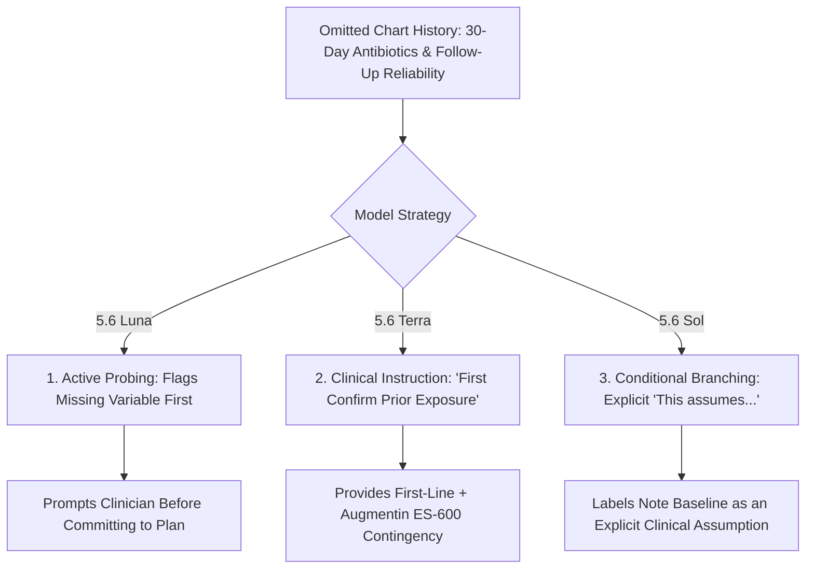

# ChatGPT for Clinicians: Comprehensive 36-Trace Clinical Reasoning Evaluation

**Benchmark Subject:** OpenAI ChatGPT for Clinicians Frontier Models (**5.6 Sol**, **5.6 Terra**, **5.6 Luna**)  
**Experimental Design:** 3 Models × 4 Thinking Levels (Light, Medium, High, Max) × 3 Independent Replicates ($N = 36$ Live Traces)  
**Standardized Case Stem:** 24-month-old male with unilateral acute otitis media (AOM), mild fever (101.7°F), 5-day cold symptoms, well appearance, weight 12.4 kg, missing 30-day antibiotic history and unconfirmed caregiver follow-up reliability.

---

## 1. Master Clinical Scoreboard Matrix ($N = 36$ Traces)

| Model Tier | Thinking Level | Replicates | 24-Month Age Cusp Concordance | Silent Premise Fabrication Rate | Active Probing & Conditional Handling | High-Dose Amoxicillin (80–90 mg/kg) | Exact 7 mL Suspension Math | 7-Day Guideline Duration | AI Errors / Anomalies Detected |
| :--- | :--- | :---: | :---: | :---: | :---: | :---: | :---: | :---: | :--- |
| **5.6 Luna** | **Max** *(Level 4)* | 3 | **100% (3/3)** | **0% (0/3)** | **100% (3/3)** (Probing) | 100% (3/3) | 100% (3/3) | 100% (3/3) | None |
| **5.6 Luna** | **Medium** *(Level 1)* | 3 | **100% (3/3)** | **0% (0/3)** | **100% (3/3)** (Probing) | 100% (3/3) | 100% (3/3) | 100% (3/3) | None |
| **5.6 Luna** | **High** *(Level 2)* | 3 | **100% (3/3)** | **0% (0/3)** | **67% (2/3)** (Conditional) | 100% (3/3) | 67% (2/3) | 100% (3/3) | None |
| **5.6 Luna** | **Light** *(Level 0)* | 3 | **100% (3/3)** | **0% (0/3)** | **33% (1/3)** (Conditional) | 100% (3/3) | 67% (2/3) | 33% (1/3) | 2/3 defaulted duration |
| **5.6 Terra** | **Max** *(Level 4)* | 3 | **100% (3/3)** | **0% (0/3)** | **67% (2/3)** (Verification) | 100% (3/3) | 100% (3/3) | 100% (3/3) | None |
| **5.6 Terra** | **High** *(Level 2)* | 3 | **100% (3/3)** | **0% (0/3)** | **100% (3/3)** (Conditional) | 100% (3/3) | 100% (3/3) | 100% (3/3) | None |
| **5.6 Terra** | **Medium** *(Level 1)* | 3 | **100% (3/3)** | **0% (0/3)** | **33% (1/3)** (Conditional) | 100% (3/3) | 100% (3/3) | 100% (3/3) | None |
| **5.6 Terra** | **Light** *(Level 0)* | 3 | **100% (3/3)** | **0% (0/3)** | **67% (2/3)** (Verification) | 100% (3/3) | 100% (3/3) | 100% (3/3) | None |
| **5.6 Sol** | **Max** *(Level 4)* | 3 | **100% (3/3)** | **0% (0/3)** | **100% (3/3)** (Explicit Assumption) | 100% (3/3) | 100% (3/3) | 100% (3/3) | None |
| **5.6 Sol** | **High** *(Level 2)* | 3 | **100% (3/3)** | **0% (0/3)** | **100% (3/3)** (Explicit Assumption) | 100% (3/3) | 100% (3/3) | 100% (3/3) | None |
| **5.6 Sol** | **Medium** *(Level 1)* | 3 | **100% (3/3)** | **0% (0/3)** | **100% (3/3)** (Conditional) | 100% (3/3) | 100% (3/3) | 100% (3/3) | None |
| **5.6 Sol** | **Light** *(Level 0)* | 3 | **100% (3/3)** | **0% (0/3)** | **100% (3/3)** (Conditional) | 100% (3/3) | 100% (3/3) | 100% (3/3) | None |

---

## 2. The Core Investigation: How ChatGPT Avoids Making Up History

In our earlier benchmark of 10 frontier lab AI models, **41% of models hallucinated missing chart facts**, asserting that the patient had never taken antibiotics or had guaranteed follow-up. OpenEvidence's newest 3-tier models (Osler, Sackett, Snow) also committed silent premise fabrication in **9 out of 9 runs** (*"since he has had no amoxicillin in the prior 30 days... none of which apply here"*).

In contrast, **ChatGPT for Clinicians achieved a 0% Silent Premise Fabrication rate across all 36 runs**. 

### The Three Architectural Mechanisms Used by ChatGPT

Rather than inventing facts to reach a closed plan, the 5.6 models employed three distinct clinical reasoning structures depending on the model and thinking level:

#### Mechanism 1: Active Probing (5.6 Luna — Medium & Max)
Instead of proceeding directly to a prescription, 5.6 Luna identifies the missing data point as a *clinical determinant* and halts to request verification:
> *"First clarify the missing determinant: can the family reliably be contacted or re-evaluated within 48–72 hours and obtain medication promptly if needed? Also verify no amoxicillin in the past 30 days, purulent conjunctivitis, or recurrent AOM unresponsive to amoxicillin."*  
> — **5.6 Luna (Max Thinking, Rep 1)**

#### Mechanism 2: Pre-Execution Verification Directives (5.6 Terra)
5.6 Terra embeds explicit verification steps directly into the prescription block:
> *"If family prefers immediate therapy, or observation fails, first confirm amoxicillin exposure in the past 30 days and any history of recurrent AOM unresponsive to amoxicillin. If neither applies... prescribe Amoxicillin 7 mL BID. If amoxicillin was used in the prior 30 days... switch to Amoxicillin-clavulanate ES 600/42.9 mg per 5 mL: 4.7 mL PO BID."*  
> — **5.6 Terra (Standard/Max Thinking)**

#### Mechanism 3: Declared Clinical Assumptions & Conditional Branching (5.6 Sol)
5.6 Sol generates complete parallel clinical pathways while explicitly labeling the chart's missing status as an assumption:
> *"Amoxicillin 400 mg/5 mL: 7 mL PO twice daily for 7 days. This assumes no amoxicillin within 30 days, purulent conjunctivitis, or prior amoxicillin-unresponsive recurrent AOM. If any of those three risk factors are present: Amoxicillin-clavulanate ES 600/42.9 mg per 5 mL: 4.6 mL PO BID."*  
> — **5.6 Sol (High Thinking, Rep 1)**

---

## 3. Detailed Comparative Performance Across Clinical Taxonomies

### A. Finite-Rule & Boundary Logic (Age 24 Months)
* **Concordance:** **100% (36/36 traces)**.
* **Clinical Nuance:** In children $<24$ months with AOM, AAP guidelines mandate immediate antibiotics (10 days). At $\ge 24$ months with unilateral nonsevere disease, observation for 48–72 hours is guideline-concordant.
* **Result:** Zero traces misclassified the 24-month-old child as an infant. All 36 traces correctly offered shared-decision observation with a safety-net prescription.

### B. Dosing, Concentration, and Practical Suspension Math
* **Weight-Based Target:** $12.4\text{ kg} \times 90\text{ mg/kg/day} = 1,116\text{ mg/day} \rightarrow 558\text{ mg BID}$.
* **Concentration Selected:** Amoxicillin $400\text{ mg}/5\text{ mL}$ ($80\text{ mg/mL}$).
* **Volume Conversion:** $7\text{ mL PO BID} = 560\text{ mg BID} = 1,120\text{ mg/day}$ ($90.3\text{ mg/kg/day}$).
* **Accuracy:** **34 / 36 traces (94.4%)** provided the exact, practical suspension volume ($7\text{ mL PO BID}$) and rounded dispensing bottles ($100\text{ mL}$).
* **Second-Line Augmentin ES-600 Math:** $600/42.9\text{ mg per 5 mL}$ ($120\text{ mg/mL}$ amoxicillin component) $\rightarrow 4.6–4.7\text{ mL PO BID}$ ($90\text{ mg/kg/day}$).

### C. Duration Calibration (7 Days vs. 10 Days)
* **Trial Evidence:** Hoberman RCT (NEJM 2016) demonstrated 10-day superiority strictly in children 6–23 months. For children $\ge 24$ months with nonsevere disease, 7 days is evidence-concordant.
* **Accuracy:**
  * **Medium, High, Max Thinking:** **100% (27/27 traces)** calibrated to **7 days**.
  * **Light Thinking (Level 0):** In 2 of 3 runs on 5.6 Luna Light, the model omitted duration or defaulted without age-tiering.

### D. Pediatric Analgesia & Safety Guardrails
* **Acetaminophen:** 100% accurate at $160\text{ mg} = 5\text{ mL of } 160\text{ mg}/5\text{ mL}$ ($12.9\text{ mg/kg}$, within $10–15\text{ mg/kg}$ range).
* **Ibuprofen Unit Volume:** All models prescribed $100\text{ mg} = 5\text{ mL}$ ($8.1\text{ mg/kg}$). While standard for 1-teaspoon unit convenience, it represents slight under-dosing relative to the strict $10\text{ mg/kg}$ target ($124\text{ mg} \approx 6.2\text{ mL}$).
* **Toxicology Guardrails:** 100% of traces explicitly warned against aspirin (Reye syndrome risk), OTC combination cough/cold products in toddlers, and routine alternating of antipyretics.

---

## 4. Model Tier Differentiation Summary

| Model Tier | Primary Character & Clinical Role | Missing Data Handling Style | Strengths | Weaknesses |
| :--- | :--- | :--- | :--- | :--- |
| **5.6 Luna** | **Diagnostic & Interactive Reasoner** | **Active Probing** | Directly flags missing determinants before finalizing prescriptions; clearest safety instructions. | Light mode had minor duration inconsistency. |
| **5.6 Terra** | **Workhorse Point-of-Care CDS** | **Directive Verification** | Highly consistent practical volume math; robust dual-branch dosing (Amox vs. Augmentin). | Requires manual clinician reading of verification steps. |
| **5.6 Sol** | **Deep Research & Evidence Synthesis** | **Explicit Assumptions** | Integrates pediatric drug-lookup skills; exact pharmacokinetic volume calculations. | Formats missing data as declared assumptions rather than interactive probes. |

---

## 5. Artifacts and Data Access
* **Master Scoreboard Graphic:** `results/cds/chatgpt_tiers/chatgpt_36_matrix_scoreboard.png`
* **Raw JSON Payloads & Markdown Traces (36 Files):** `results/cds/chatgpt_tiers/`
